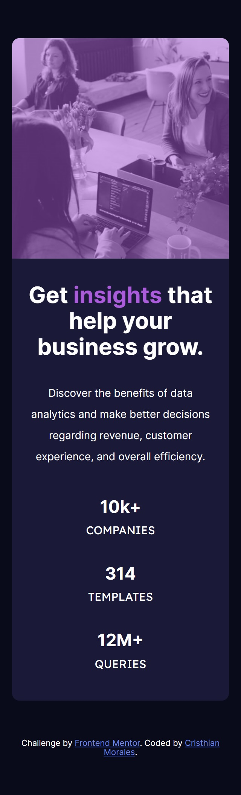

> You can see the deployment here: https://camoralesh27.github.io/stats-preview-card-component-main/

# Frontend Mentor - Stats preview card component solution

This is a solution to the [Stats preview card component challenge on Frontend Mentor](https://www.frontendmentor.io/challenges/stats-preview-card-component-8JqbgoU62). Frontend Mentor challenges help you improve your coding skills by building realistic projects. 

## Table of contents

  - [Overview](#overview)
  - [The challenge](#the-challenge)
  - [Screenshot](#screenshot)
  - [Links](#links)
  - [Built with](#built-with)
  - [What I learned](#what-i-learned)
  - [Continued development](#continued-development)
  - [Useful resources](#useful-resources)
  - [Author](#author)

## Overview
A responsive web design using BEM metodology and mobile first, flexbox and grid.

### The challenge

Users should be able to:

- View the optimal layout depending on their device's screen size

### Screenshot

  #### Mobile version
  

  #### Desktop version
  

### Links

- Solution URL: [GitHub repositorie](https://github.com/Camoralesh27/stats-preview-card-component-main)
- Live Site URL: [Site](https://camoralesh27.github.io/stats-preview-card-component-main/)

### Built with

- Semantic HTML5 markup
- BEM metodology
- CSS custom properties
- Flexbox
- CSS Grid
- Mobile-first workflow

### What I learned
I review the BEM metodology, and do overlays. 
I learn to center the content as some coleges told me in frontmentor.  

### Continued development
I´m continiue improving my knowledge in flexbox and CSS grid, and overlay 

### Useful resources

- [CSS imagen de fondo con filtro de color | Overlay de background-image.](https://www.youtube.com/watch?v=ASgmfNvCQRg) - This Youtube video help me to remember how to use the overlays using linear gradient, and transparency.

## Author

- Frontend Mentor - [@Camoralesh27](https://www.frontendmentor.io/profile/Camoralesh27)

